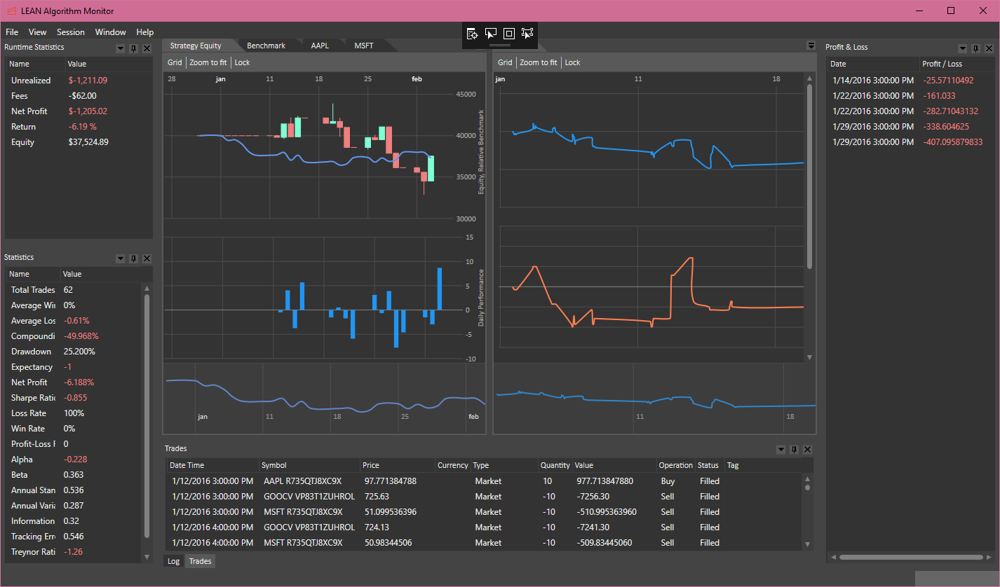

Lean Algorithm Monitor
=========

## Introduction ##
Lean Algorithm Monitor is an open-source Windows Desktop based tool to browse Lean engine's backtest and live monitor progress and results.

## Lean C# Algorithmic Trading Engine ##
This tool visualizes data generated by the [Lean Engine][1]. Lean Engine is an open-source fully managed C# algorithmic trading engine built for desktop and cloud usage. Lean drives the web based backtesting platform [QuantConnect][2].

## Building the solution ##
The solution has been built using Microsoft Visual Studio 2017 (Community Edition).
Make sure to restore NuGet packages if your environment is not configured to Restore them automatically when building.
The solution has a reference to the `QuantConnect.Common` Namespace in the `QuantConnect.Common.dll` library. This file is not included and can be compiled from the [Lean][1] project.

## Starting the application ##
The monitor supports two modes: File and Stream.

### Opening a file ###
The monitor can read exported `.JSON` files (i.e. by the [Quant Connect Algorithm Lab][2]) or exported by the Monitor itself.

- Star the application and provide the path to the `.JSON` file in the `Open Session > From File` tab.
- When `Monitor for changes` has been enabled, the monitor will watch the file for changes. When they occur, all new data since the last time it has been opened will be appended.

### Starting from a stream ###
The monitor reads status messages generated by the Lean `StreamingMessageHandler`, just like the default `Views` application included with the Engine.
- Configure the [Launcher configuration file][4]. The has an example named `backtesting-desktop`.
- Alter the `desktop-exe` to point to the compiled `Monitor.exe`
- Option: When using the example, disable the `send-via-api` if you do not want to use API functionality. The API is not required to plot charts.

## Issues and Feature Requests ##
This tool has initially been built for personal purposes. it is a proof-of-concept (Alpha) and might contain bugs including performance issues and incorrect calculations among others. Please submit bugs and feature requests as an issue to the [AlgorithmMonitor Repository][3]. Contributions are welcomed!

[1]: https://github.com/QuantConnect/Lean "Lean Engine"
[2]: https://www.quantconnect.com "QuantConnect"
[3]: https://github.com/mirthestam/lean-monitor/issues
[4]: https://github.com/QuantConnect/Lean/blob/master/Launcher/config.json